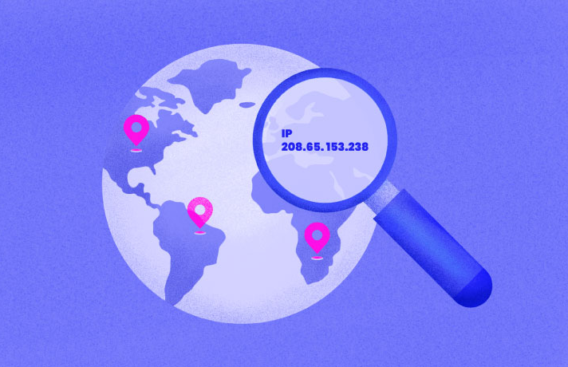

# IP-Geolocator

## Descrizione

 IP Geolocator è un'applicazione C# che utilizza l'API di 'https://ipinfo.io/' per ottenere informazioni dettagliate su un indirizzo IP specifico. Fornisce dati come la posizione geografica (paese, città, coordinate), il codice postale, la regione e il provider di servizi Internet (ISP). Include anche un link diretto a Google Maps per visualizzare le coordinate geografiche sulle mappe. È uno strumento rapido e intuitivo per esplorare informazioni sugli indirizzi IP. 

## Tech-stack

 Il progetto è realizzato interamente con C# 

## Installazione

 Per installare IP Geolocator sul tuo computer, segui questi semplici passaggi: 

 1. Apertura di Visual Studio Code e installazione dell'estensione 'C# Dev Kit': Apri Visual Studio Code, installa l'estensione 'C# Dev Kit' se non è già installata. 

 2. Creazione del progetto: Premi 'CTRL + SHIFT + P' per aprire la 'tavolozza dei comandi (command palette)'. Seleziona '.NET: Nuovo Progetto...' e scegli 'Console App' come tipo di progetto, inserisci il nome del progetto quando richiesto. 

 3. Inserimento del codice: Nel file 'Program.cs' creato da Visual Studio Code, incolla il codice presente nel file 'Program.cs' su GitHub, oppure, sostituisci tutti i file del progetto con il file zip disponibile su GitHub. 

 4. Esecuzione del codice: Assicurati di avere installato 'Dot.Nev' dal sito della Microsoft. Apri il terminale in Visual Studio Code e scrivi il seguente comando per eseguire il codice: 'dotnet run' 

 Seguendo questi passaggi, dovresti essere in grado di eseguire l'applicazione IP Geolocator sul tuo computer e ottenere informazioni dettagliate sugli indirizzi IP. 

## Screenshot:

## Autore:
Sviluppatore Simeone Daniele e Scala Fabio
